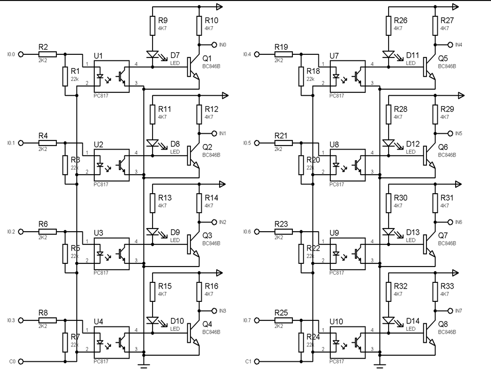

PICPLC projesinin orjinal bilgileri 
<a href="http://cq.cx/ladder.pl" target="_blank">http://cq.cx/ladder.pl</a>
adresinde yayýnlanmaktadýr.

Biz bu projeyi kullanarak elektronik kartlar yapmayý hedefledik.

Yaptýðýmýz PCB tasarýmlarýmýzý OSTIM MTAL elektrik-elektronik bölümünde PLC konulu derslerimizde kullandýk.
Derslerimizde kullandýðýmýz örneklerimizi de examples klasöründe bulabilirsiniz.

H.SERIMER 

PCB tasarýmlarýmýz.
	PLC4I40 - PIC16F628A ile 4 giriþ 4 çýkýþ PLC kartý
	PLC8I80 - PIC16F874A ile 8 giriþ 8 çýkýþ PLC kartý
	
PLC4I40 Devre þemasý

PLC8I80 Devre þemasý

